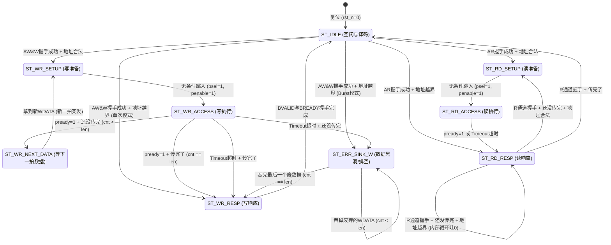

# 🌉 AXI4-Full to APB4 高性能多节点同步桥接器与验证平台

本项目从零独立设计并实现了一个高性能的 AXI4 到 APB4 同步桥接模块。突破了传统 Lite 版本的单笔限制，完整实现了 **AXI4 Burst 突发传输状态机**（支持 INCR 模式），并通过底层移位逻辑极大地优化了硬件面积。

同时，本项目抛弃了传统的 Verilog Testbench，基于 **Python + cocotb** 构建了全协程驱动的高级自动化验证平台，并植入了工业级 **SVA (SystemVerilog Assertions)** 协议防线。

---

## 🚀 核心特性与工程贡献

* **📦 AXI4 Burst 突发传输支持：** 完整解析 AXI4 突发请求，通过内部状态机将 AXI 长突发拆解为连续的 APB 单次传输。**核心亮点**：利用 `(1 << awsize)` 移位操作替代乘法器实现地址精准递增，实现零延迟与极低面积开销的 PPA 优化。
* **🔀 1 拖 4 智能路由与地址译码：** 基于总线地址 `[13:12]` 位，使用独热码移位逻辑（无比较器）实现了 4 个不同特性 APB 从设备的精准路由：
  * `Device 0` (`0x0000~0x0FFF`)：零延迟极速响应设备
  * `Device 1` (`0x1000~0x1FFF`)：多拍 Wait-state 延迟设备
  * `Device 2` (`0x2000~0x2FFF`)：只读异常设备 (写入触发报错)
  * `Device 3` (`0x3000~0x3FFF`)：状态自增智能设备
* **🛡️ 高阶异常防御与“数据黑洞”排空机制：** 严格遵循 AXI 不可中途打断突发的铁律。当发生**地址越界**或**长时间 Timeout 超时**时，桥接器会自动切入 `ST_ERR_SINK_W` (数据排空黑洞) 状态，安全吞掉主机发来的冗余 WDATA，防止总线死锁，并最终安全返回 `SLVERR`。
* **🧪 现代工程化验证 (Cocotb & SVA)：** 使用 Python 编写后台 Mock Slave 协程自动机，实现复杂延迟与报错注入。底层 RTL 代码植入多条 SVA 并发断言，24小时监控诸如 `VALID/READY 握手死锁`、`APB 地址防抖` 等 ARM 官方底层时序规范（并使用宏隔离兼容开源 Icarus 仿真器）。

---

## 🧠 桥接器核心架构：V2.0 突发状态机流转图



---

## 📈 自动化仿真测试日志 (Cocotb)

通过 5 大核心极端场景的高强度回归验证，**SVA 断言 0 报错，全测试用例 PASS**：

```text
VCD info: dumping is suppressed.
    40.00ns INFO     cocotb.tb_axi_lite_to_apb_bridge   ========== 场景 1: 访问 Device 0 (UART, 极速响应) @ 0x00000100 ==========
   110.00ns INFO     cocotb.tb_axi_lite_to_apb_bridge   ========== 场景 2: 访问 Device 1 (SPI, 延迟 3 拍) @ 0x00001200 ==========
   200.00ns INFO     cocotb.tb_axi_lite_to_apb_bridge   ========== 场景 3: 访问 Device 2 (GPIO, 故意引发报错) @ 0x00002300 ==========
   270.00ns INFO     cocotb.tb_axi_lite_to_apb_bridge   ========== 场景 4: 访问 Device 3 (Timer, 验证自增逻辑) @ 0x00003400 ==========
   390.00ns INFO     cocotb.tb_axi_lite_to_apb_bridge   ========== 场景 5: 越界访问 (黑洞拦截) @ 0x00004500 ==========
   430.00ns INFO     cocotb.tb_axi_lite_to_apb_bridge   ========== 全局通关：多设备地址映射与异常注入测试全部 PASS！ ==========
   430.00ns INFO     cocotb.regression                  test_axi2apb_basic.test_multi_slave_mapping passed
   430.00ns INFO     cocotb.regression                  *****************************************************************************************************
                                                        ** TEST                                                 STATUS  SIM TIME (ns)  REAL TIME (s)  RATIO (ns/s) **
                                                        *****************************************************************************************************
                                                        ** test_axi2apb_basic.test_multi_slave_mapping          PASS         430.00           0.01      71683.26  **
                                                        *****************************************************************************************************
                                                        ** TESTS=1 PASS=1 FAIL=0 SKIP=0                                      430.00           0.01      47779.98  **
                                                        *****************************************************************************************************
```

---

*This project is fully designed, tested, and verified for high-performance SoC integration.*
